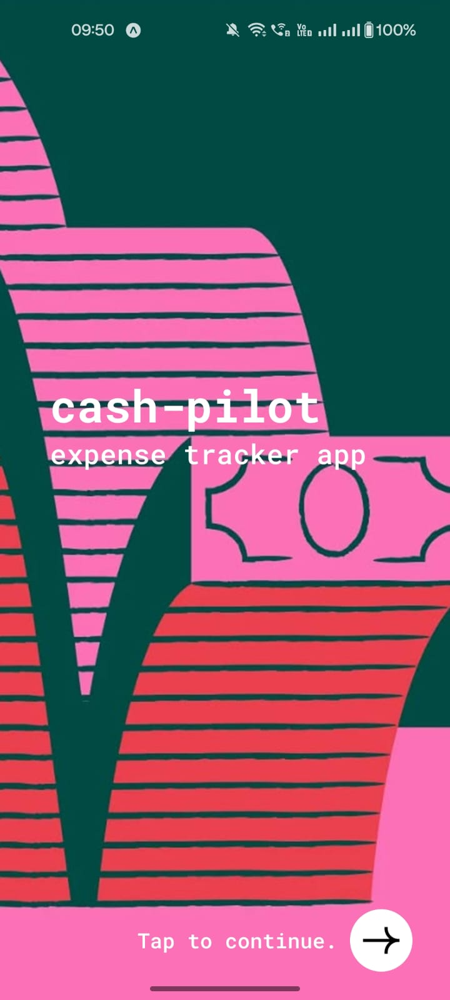
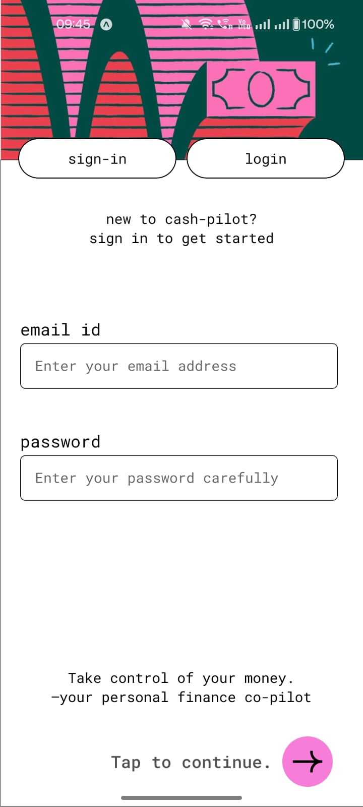
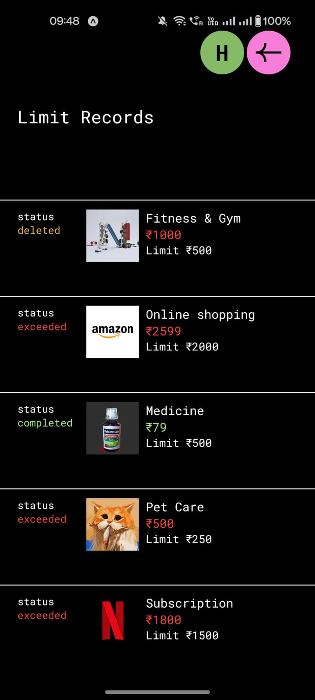
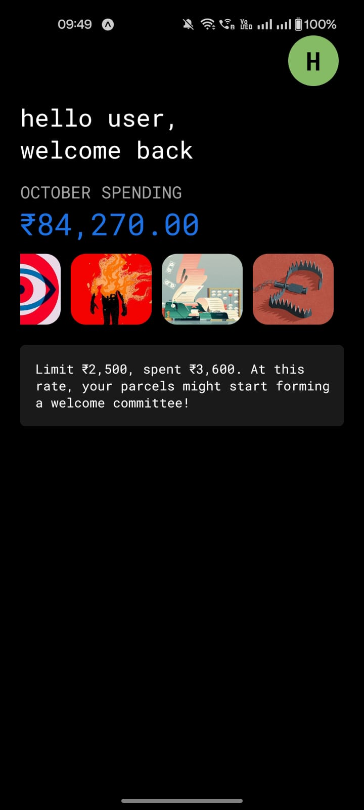
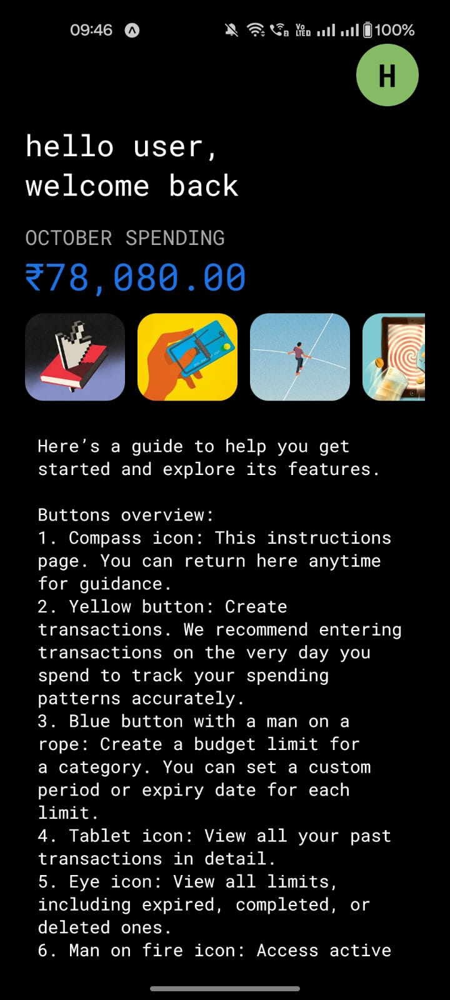
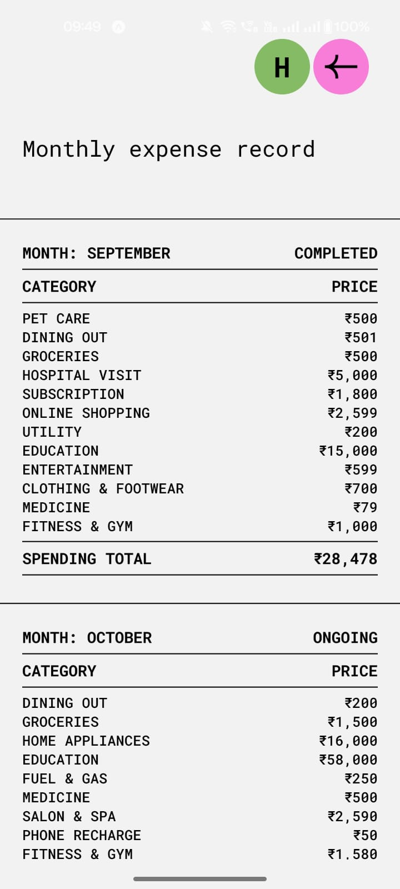
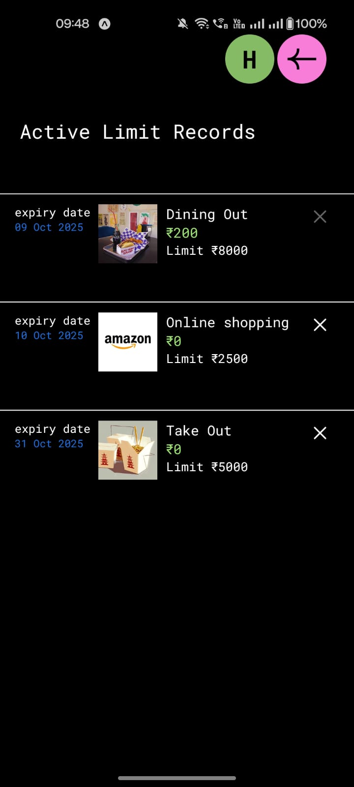
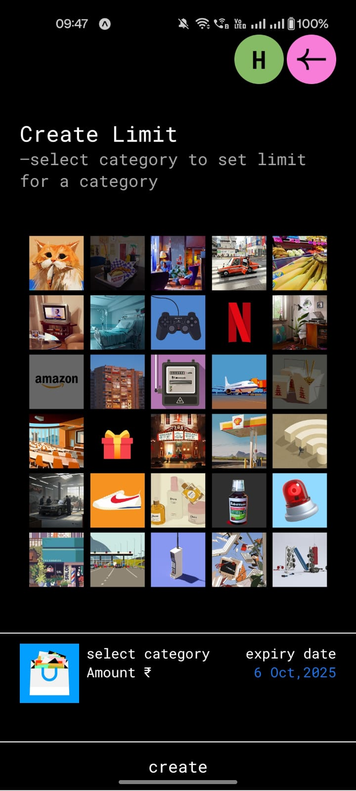
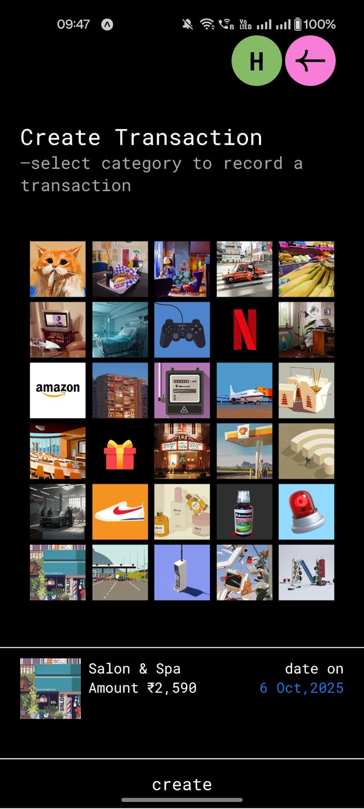
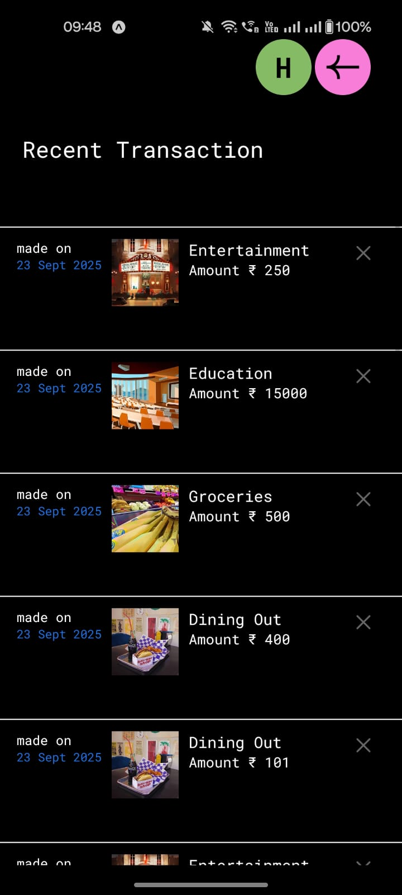

# Expense Tracker App — FARM Stack

### About

Expense Tracker is a personal finance management app built using the FARM stack — FastAPI, React Native, and MongoDB, with Expo, VS Code, and Figma used for development and UI/UX design.

It helps users set spending limits, track expenses, and analyze monthly spending through a clean and intuitive interface.

### Tech Stack

- **Frontend:** React Native + Expo
- **Backend:** FastAPI (Python)
- **Database:** MongoDB (NoSQL)
- **Design:** Figma (UI/UX Design)
- **IDE:** Visual Studio Code

### Features

1. **Category Limits** — Set budget limits for individual spending categories.
2. **Transaction Log** — Record transactions with date, category, and amount.
3. **Ongoing Limits** — Track currently active category limits.
4. **Limit History** — Review completed, exceeded, or deleted limits.
5. **Monthly Summary** — Visualize total spending by category for each month.
6. **Budget Violation Alerts** — Receive notifications when spending exceeds a set budget limit.

### App Preview

  
  &nbsp;&nbsp;
  
  &nbsp;&nbsp;
  
  &nbsp;&nbsp;
  
  &nbsp;&nbsp;
  
  &nbsp;&nbsp;
  
  &nbsp;&nbsp;
  
  &nbsp;&nbsp;
  
  &nbsp;&nbsp;
  
  &nbsp;&nbsp;
  

